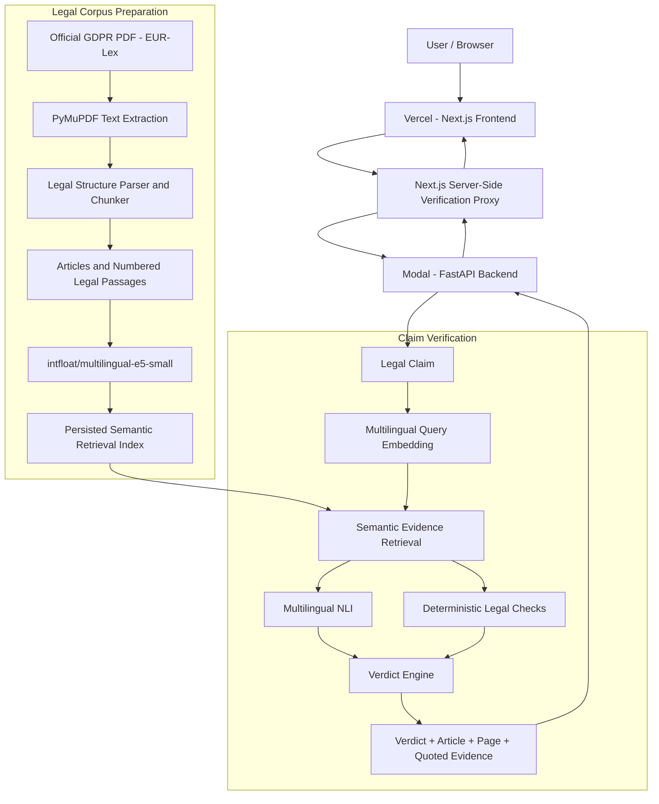

# LexProof

**Evidence-first verification for AI-generated legal claims.**

LexProof verifies legal statements against authoritative primary law instead of asking another AI model whether a claim merely sounds correct.

The current prototype verifies claims against the **EU General Data Protection Regulation (GDPR)** and returns one of three evidence-backed verdicts:

- **SUPPORTED**
- **CONTRADICTED**
- **INSUFFICIENT EVIDENCE**

Each result includes the relevant legal provision, page reference, quoted primary-law evidence, verification confidence, and a link to the official EUR-Lex source.

> **Disclaimer:** LexProof is an automated legal-information prototype. It is not legal advice.

---

## Live Demo

**LexProof:** https://lexproof-three.vercel.app/

**GitHub:** https://github.com/ismayilysfli/lexproof

---

## The Problem

Generative AI can produce legal statements that sound confident and plausible even when they are incomplete, unsupported, or wrong.

In legal contexts, the important question is not:

> “Does this answer sound correct?”

It is:

> **“What does the primary law actually say?”**

LexProof adds an evidence-verification layer between AI-generated legal claims and the user.

Instead of relying on another generated answer, LexProof retrieves authoritative legal text and checks the claim directly against that evidence.

---

## What LexProof Does

A user submits a legal claim.

LexProof:

1. embeds the claim using a multilingual semantic model,
2. retrieves the most relevant provisions from the GDPR,
3. evaluates the relationship between the claim and the legal evidence,
4. applies deterministic checks for conflicts such as numerical deadlines,
5. returns an evidence-backed verdict,
6. shows the relevant article, page, quoted text, and official source.

The three possible verdicts are:

### Supported

Primary legal evidence supports the claim.

### Contradicted

Primary legal evidence directly conflicts with the claim.

### Insufficient Evidence

Relevant law may have been found, but the retrieved evidence does not establish or directly disprove the claim.

This distinction is important because:

```text
No evidence for a claim
```

does **not** automatically mean:

```text
The law says the opposite
```

---

## Demo Examples

### 1. Supported

**Claim**

> A controller must notify the supervisory authority of certain personal data breaches within 72 hours where feasible.

**LexProof result**

```text
SUPPORTED
Article 33
```

GDPR Article 33 states that notification should occur without undue delay and, where feasible, no later than 72 hours after the controller becomes aware of the breach.

---

### 2. Contradicted

**Claim**

> A controller must report a personal data breach within 24 hours.

**LexProof result**

```text
CONTRADICTED
Article 33
```

LexProof identifies the concrete deadline conflict:

```text
Claim: 24 hours
Law:   72 hours

24 hours ≠ 72 hours
```

---

### 3. Insufficient Evidence

**Claim**

> Every company must give customers a free laptop after a personal data breach.

**LexProof result**

```text
INSUFFICIENT EVIDENCE
```

The GDPR does not establish this obligation.

LexProof therefore avoids incorrectly treating the absence of supporting evidence as a direct legal contradiction.

---

### 4. Direct-Marketing Right

**Claim**

> I can object to my personal data being used for direct marketing.

**LexProof result**

```text
SUPPORTED
Article 21
```

LexProof retrieves the GDPR provision establishing the data subject's right to object to processing for direct-marketing purposes.

---

## Architecture



---

## Verification Pipeline

### 1. Primary-Law Ingestion

The prototype uses the official English GDPR PDF from **EUR-Lex**.

LexProof extracts the document using **PyMuPDF** while preserving useful legal metadata such as:

- article heading,
- article number,
- chapter,
- section,
- page number,
- legal text.

The GDPR parser identifies all **99 articles**.

---

### 2. Legal Structure and Passage Construction

Legal documents are not treated as arbitrary blocks of text.

LexProof preserves the structure of the regulation and creates semantic passages from the legal provisions.

Large articles can be divided into smaller passages while retaining their original article and page metadata.

The verifier can also evaluate complete numbered legal paragraphs independently.

This is important because a relevant sentence can otherwise be diluted by unrelated text from a long provision.

---

### 3. Semantic Retrieval

LexProof uses:

```text
intfloat/multilingual-e5-small
```

for multilingual semantic embeddings.

A user's claim is embedded as a query and compared against the legal passage index.

The most relevant GDPR passages are then retrieved for verification.

---

### 4. Natural-Language Inference

Retrieved passages are evaluated using:

```text
MoritzLaurer/multilingual-MiniLMv2-L6-mnli-xnli
```

The verifier analyzes whether the legal evidence:

- supports the claim,
- contradicts the claim,
- or does not provide enough evidence to establish either relationship.

---

### 5. Deterministic Legal Checks

Natural-language inference is combined with deterministic checks where explicit conflicts can be identified more reliably.

For example:

```text
Claim: 24 hours
GDPR: 72 hours
```

LexProof detects the deadline mismatch and uses it as explicit contradiction evidence.

This also helps preserve legally important details such as numerical limits and deadlines.

---

### 6. Evidence-Backed Result

LexProof returns more than a label.

A verification result can include:

- verdict,
- confidence,
- GDPR article,
- article title,
- chapter and section,
- page number,
- quoted legal text,
- retrieval score,
- NLI information,
- deterministic conflict information,
- official primary-source link.

The purpose is to allow the user to inspect the underlying law rather than simply trust the model.

---

## Why Three Verdicts?

A binary true/false system is not sufficient for legal verification.

Consider an unrelated claim such as:

> Buying a yacht for me is an obligation for my boss.

The GDPR does not establish such an obligation.

But that does not necessarily mean a retrieved GDPR provision directly states that the claim is false.

LexProof therefore returns:

```text
INSUFFICIENT EVIDENCE
```

rather than forcing every unsupported statement into the `CONTRADICTED` category.

This separation between **contradiction** and **absence of evidence** is one of the core design principles of LexProof.

---

## Multilingual Retrieval

LexProof uses multilingual embedding and NLI models.

This allows claims expressed in languages other than English to retrieve semantically related provisions from the English GDPR corpus.

The current prototype's authoritative legal corpus remains the official English GDPR text.

---

## Tech Stack

### Frontend

- Next.js
- TypeScript
- Tailwind CSS
- Vercel

### Backend

- Python
- FastAPI
- NumPy
- PyMuPDF
- sentence-transformers
- Hugging Face Transformers
- PyTorch
- Modal

### Retrieval Model

```text
intfloat/multilingual-e5-small
```

### Verification Model

```text
MoritzLaurer/multilingual-MiniLMv2-L6-mnli-xnli
```

### Primary Legal Source

**Regulation (EU) 2016/679 — General Data Protection Regulation**

Official source:

https://eur-lex.europa.eu/eli/reg/2016/679/oj

LexProof does not rely on a paid legal API.

---

## Production Deployment

LexProof is deployed using two services:

```text
Browser
   |
   v
Vercel
Next.js frontend
   |
   v
Next.js server-side verification proxy
   |
   v
Modal
FastAPI backend
   |
   +--> Semantic retrieval
   |
   +--> Multilingual NLI
   |
   +--> Deterministic checks
   |
   v
Persisted GDPR legal index
```

The backend automatically restores the legal retrieval index when a container starts.

The machine-learning models and legal verification logic run in the backend rather than inside the browser.

---

## Testing

LexProof includes automated tests covering the backend, retrieval system, verifier, API behavior, frontend, browser workflows, accessibility, and production contracts.

During development, the project reached:

- **36 backend tests passing**
- **8 verification benchmark cases passing**
- **22 frontend/browser/contract tests passing**

Important regression cases include:

```text
72-hour breach notification
→ SUPPORTED
→ Article 33

24-hour breach notification
→ CONTRADICTED
→ Article 33
→ deterministic time conflict

Direct-marketing objection
→ SUPPORTED
→ Article 21

Free-laptop obligation
→ INSUFFICIENT EVIDENCE

Unrelated yacht obligation
→ INSUFFICIENT EVIDENCE
```

---

## Local Development

### Clone the Repository

```bash
git clone https://github.com/ismayilysfli/lexproof.git
cd lexproof
```

---

### Backend

Create and activate a Python virtual environment:

```powershell
cd backend

python -m venv .venv

.\.venv\Scripts\Activate.ps1

pip install -r requirements.txt
```

Start the FastAPI backend using the project's local backend configuration.

---

### Frontend

From the `frontend` directory:

```powershell
npm install
npm run dev
```

Create:

```text
frontend/.env.local
```

and add:

```text
LEXPROOF_API_URL=http://localhost:8000
```

or point it to another running LexProof backend.

Then open:

```text
http://localhost:3000
```

---

## Repository Structure

```text
lexproof/
├── backend/
│   ├── app/
│   │   ├── services/
│   │   └── ...
│   ├── tests/
│   ├── modal_app.py
│   └── requirements.txt
│
├── frontend/
│   ├── app/
│   ├── public/
│   └── ...
│
├── data/
│   ├── indexes/
│   └── test-laws/
│
├── scripts/
├── pytest.ini
├── .gitignore
└── README.md
```

---

## Current Scope

LexProof is a hackathon prototype designed to validate an evidence-first legal verification architecture.

The currently validated legal corpus contains one primary source:

```text
EU General Data Protection Regulation
```

LexProof should therefore not be interpreted as a general-purpose global legal research platform.

The current confidence value represents evidence/model strength within the verification pipeline.

It is **not** a calibrated probability that a legal proposition is universally true.

---

## Challenges

### Distinguishing Contradiction from Missing Evidence

One of the hardest problems was preventing unrelated claims from being classified as contradictions simply because retrieved legal text did not support them.

This led to the explicit three-way verdict design:

```text
SUPPORTED
CONTRADICTED
INSUFFICIENT EVIDENCE
```

---

### Context Dilution

A claim about the right to object to direct marketing correctly retrieved GDPR Article 21, but evaluating a large mixed passage initially weakened the entailment signal.

LexProof was improved to evaluate complete numbered paragraphs alongside the larger retrieved passage while preserving article metadata.

This allowed the relevant Article 21 provision to produce the correct supported result without hardcoding a rule specifically for that article.

---

### Serverless Deployment

The inference backend requires:

- PyTorch,
- two language models,
- the legal corpus,
- and a persisted embedding index.

The deployment therefore needed to ensure that every new container could restore its legal index and verification models correctly.

The production Modal backend now initializes with the required GDPR evidence index automatically.

---

## What We Learned

Legal verification is not the same problem as general question answering.

High-quality retrieval alone is not enough.

A useful legal verification system must:

- preserve legal document structure,
- retain qualifications such as **“where feasible,”**
- distinguish contradiction from missing evidence,
- handle explicit numerical conflicts carefully,
- preserve article and page metadata,
- expose primary-law evidence to the user.

The goal is not to hide the result behind another generated explanation.

The goal is to make the evidence inspectable.

---

## What's Next

The current prototype validates LexProof using the GDPR.

Future versions could support:

- multiple jurisdictions,
- additional statutes and regulations,
- court decisions and case law,
- automatic jurisdiction detection,
- legal-domain detection,
- improved confidence calibration,
- citation graph analysis,
- larger legal corpora,
- automatic verification of complete AI-generated legal answers,
- a verification API for other legal AI systems.

The longer-term goal is to make LexProof an evidence layer that other AI systems can use before presenting legal claims to users.

---

## Hackathon

Built for **LexHack 2026 — AI + Law Student Hackathon**.

The project was developed as a working legal-tech prototype combining:

- legal document processing,
- multilingual semantic retrieval,
- natural-language inference,
- deterministic legal checks,
- explainable evidence presentation,
- automated testing,
- and production deployment.

Public legal sources, open-source frameworks, and pretrained language models used by LexProof are credited in this README.

---

## Disclaimer

LexProof provides automated analysis of legal source material for informational, educational, and research purposes.

It is **not legal advice** and does not replace advice from a qualified legal professional.

---

## Core Idea

> **Don't just generate legal claims. Prove them.**